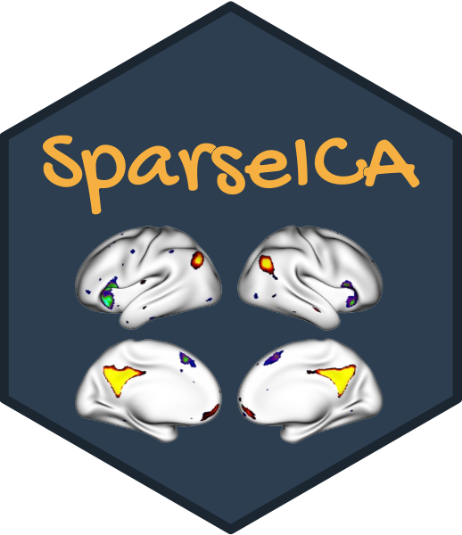
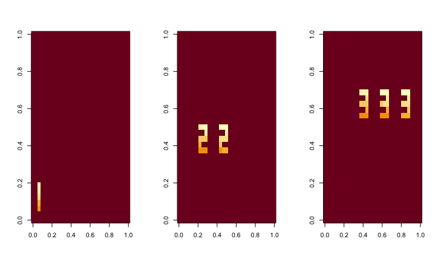
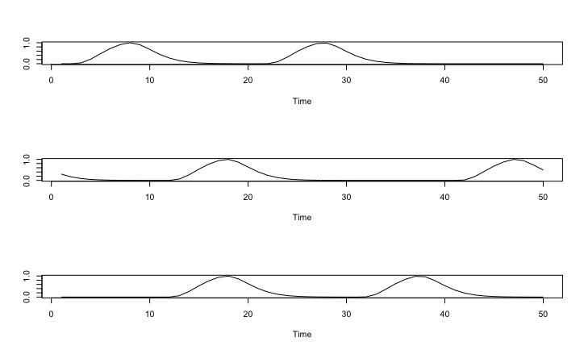
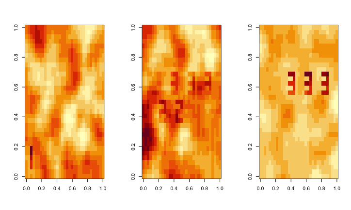
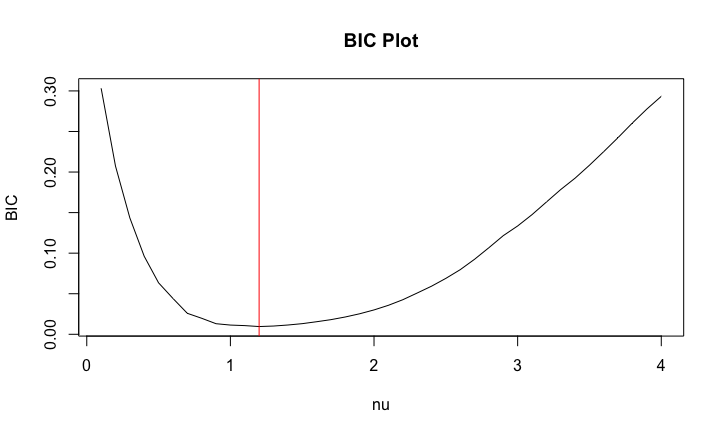
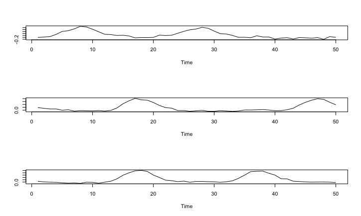

SparseICA: Sparse Independent Component Analysis 
===================================================

<br>

Sparse ICA (Sparse Independent Component Analysis) is a novel ICA method that enables sparse estimation of independent source components.

## Installation

We assume you are running R 4.1.0 or newer. There is no guarantee for backward or forward comparability. Please raise the issue on GitHub if something breaks.

The following R packages are required:

- Rcpp (>= 1.0.9)
- RcppArmadillo (>= 0.12.0.0.0)
- MASS (>= 7.3-58.1)
- irlba (>= 2.3.5)
- clue (>= 0.3)
- devtools

You can install them by running this code:

```r
if(!require(c("Rcpp","RcppArmadillo","MASS","irlba","clue","devtools"))){
    install.packages(c("Rcpp","RcppArmadillo","MASS","irlba","clue","devtools"))
}
```

Then you can install Sparse ICA from github with:

``` r
library(devtools)
install_github("thebrisklab/SparseICA")
# Load the package
library(SparseICA)
```

## Tutorial

The `sparseICA()` is the main function of our Sparse ICA algorithm. It is implemented in both pure R and Rcpp.
The `BIC_sparseICA()` selects the tuning parameter nu based on our proposed BIC-like criterion.     

### Explanation of Arguments  
#### 1. sparseICA function
```
sparseICA(xData,n.comp,nu = 1,U.list=NULL,whiten = c('eigenvec','sqrtprec','lngca','none'), orth.method=c('svd','givens'), method = c("C","R"), restarts = 40, lambda = sqrt(2)/2, irlba = FALSE, eps = 1e-06, maxit = 500, verbose=TRUE, converge_plot = FALSE,col.stand=TRUE, row.stand=FALSE, iter.stand=0, positive_skewness=TRUE)
```
- `xData`: Input data matrix with dimension P x T. P is the number of features. T is the number of samples.
- `n.comp`: The number of components.
- `nu`: the tuning parameter controlling the accuracy and sparsity of the results. Should be selected by the BIC-like criterion "BIC_sparseICA_R()" or expert knowledge. The default is 1.
- `U.list`: The initialization of U matrix. Default is "NULL".
- `whiten`: The method for whitening input xData. Could take "eigenvec", "sqrtprec", "lngca", and "none". The default is "eigenvec".
- `orth.method`: The method used for generating initial values of U matrix. The default is "svd".
- `method` If method == "C" (default) then C code is used to perform most of the computations, which makes the algorithm run faster. If method == "R" then computations are done exclusively in R.
- `restarts`: The number of initial points. Default is 40.
- `lambda`: The scale parameter in Laplace density. The default is sqrt(2)/2 to make the default situation with unit variance.
- `irlba`: Whether use the irlba method to perform fast truncated singular value decomposition in whitening step. The default is FALSE.
- `eps`: The convergence threshold. The default is 1e-6.
- `maxit`: The maximum number of iterations in the Sparse ICA method with Laplace density. The default number is 500.
- `verbose`: Whether print the information about convergence. The default is FALSE.
- `converge_plot`: Whether make a convergence plot for Sparse ICA method. The default is FALSE.
- `col.stand`: Whether standardize the data matrix column-wise. Default if TRUE.
- `row.stand`: Whether standardize the data matrix row-wise. Default if FALSE.
- `iter.stand`: The number of standardization. Default is 0.
- `positive_skewness`: Whether to make the estimated components have positive skewness. Default is TRUE.

#### 2. BIC_sparseICA function
```
BIC_sparseICA(xData,n.comp,nu_list = seq(0.1,4,0.1),U.list=NULL,whiten = c('eigenvec','sqrtprec','lngca,'none'), orth.method=c('svd','givens'), method = c("C","R"), restarts = 40, lambda = sqrt(2)/2, irlba = FALSE, eps = 1e-06, maxit = 500, verbose=TRUE,col.stand=TRUE, row.stand=FALSE, iter.stand=0, BIC_plot = FALSE)
```
- `xData` Input data matrix with dimension P x T. P is the number of features. T is the number of samples.
- `n.comp` The number of components.
- `nu_list` the list of candidate tuning parameter. Default is seq(0.1,4,0.1).
- `U.list` The initialization of U matrix. Default is "NULL".
- `whiten` The method for whitening input xData. Could take "eigenvec", "sqrtprec", 'lngca', and "none". The default is "eigenvec".
- `orth.method` The method used for generating initial values of U matrix. The default is "svd".
- `method` If method == "C" (default) then C code is used to perform most of the computations, which makes the algorithm run faster. If method == "R" then computations are done exclusively in R.
- `lambda` The scale parameter in Laplace density. The default is sqrt(2)/2 to make the default situation with unit variance.
- `irlba` Whether use the irlba method to perform fast truncated singular value decomposition in whitening step. The default is FALSE.
- `eps` The convergence threshold. The default is 1e-6.
- `maxit` The maximum number of iterations in the Sparse ICA method with Laplace density. The default number is 500.
- `verbose` Whether print the information about convergence. The default is FALSE.
- `col.stand` Whether standardize the data matrix column-wise. Default if TRUE.
- `row.stand` Whether standardize the data matrix row-wise. Default if FALSE.
- `iter.stand` The number of standardization. Default is 0.
- `BIC_plot` Whether make a convergence plot for BIC selection. The default is FALSE.

### Explanation of Output
#### 1. sparseICA function
The output will be a list with 7 components as such:
- `loglik_restarts`: he value of minimal log-likelihood among random initialization.
- `estS`: The estimated sparse independent components matrix with dimension P x Q.
- `estU`: The estimated U matrix with dimension Q x Q.
- `converge`: The convergence of the U matrix.
- `distribution`: The density used in ICA method.
- `whitener`: The whitener matrix used to perform data whitening.
- `estM`: Estimated mixing matrix with dimension Q x T.

#### 2. BIC_sparseICA function
Function outputs a list including the following:
- `BIC` The list of BIC values corresponding to each candidate in the nu_list.
- `nu_list` The list of candidate tuning parameter nu.
- `best_nu` The best nu selected by BIC-like criterion.


## Example
Load the example data:
``` r
data(example_sim123)
```

### 1. Visualization of example data
- The true "source signals" - `smat`:
```r
par(mfrow=c(1,3))
image(matrix(-smat[,1],33))
image(matrix(-smat[,2],33))
image(matrix(-smat[,3],33))
par(mfrow=c(1,1))
```


- The true time series in the mixing matrix - `mmat`:
```r
par(mfrow=c(3,1))
plot(mmat[1,],type = "l",xlab = "Time",ylab = "")
plot(mmat[2,],type = "l",xlab = "Time",ylab = "")
plot(mmat[3,],type = "l",xlab = "Time",ylab = "")
par(mfrow=c(1,1))
```


- The simulated data matrix at three time points - `xmat`:
```r
par(mfrow=c(1,3))
image(matrix(xmat[,12],33))
image(matrix(xmat[,23],33))
image(matrix(xmat[,35],33))
par(mfrow=c(1,1))
```


### 2. Tuning parameter selection
- Select the best tuning parameter `nu` using `BIC_sparseICA` function.
```r
select_sparseICA = BIC_sparseICA(xData = xmat, n.comp = 3, U.list = NULL,
                                   whiten = "eigenvec", method = "C", lambda = sqrt(2)/2,
                                   eps = 1e-6,maxit = 500, BIC_plot = TRUE,verbose=FALSE,
                                   nu_list = seq(0.1,4,0.1))
my_nu = select_sparseICA$best_nu
```


The best `nu` is 1.2.


### 3. Run Sparse ICA
- Perform our Sparse ICA algorithm based on the selected `nu` using `sparseICA` function.
```r
my_sparseICA = sparseICA(xData = xmat, n.comp = 3, nu = my_nu, U.list = NULL,
                           whiten = "eigenvec", orth.method = "svd", method = "C",restarts = 40,
                           lambda = sqrt(2)/2, eps = 1e-6, maxit = 500, verbose=TRUE)
```

### 4. Visualization of Sparse ICA results
- Match estimates with the truth.
```r
matched_res=matchICA(my_sparseICA$estS,smat,my_sparseICA$estM)
```

- Check the estimated source signals.
```r
par(mfrow=c(1,3))
image(matrix(-matched_res$S[,1],33,33))
image(matrix(-matched_res$S[,2],33,33))
image(matrix(-matched_res$S[,3],33,33))
par(mfrow=c(1,1))
```


- Check the estimated time series in the mixing matrix.
```r
par(mfrow=c(3,1))
plot(matched_res$M[1,],type = "l",xlab = "Time",ylab = "")
plot(matched_res$M[2,],type = "l",xlab = "Time",ylab = "")
plot(matched_res$M[3,],type = "l",xlab = "Time",ylab = "")
par(mfrow=c(1,1))
```


- Check the correlations.
```r
> cor(smat[,1],matched_res$S[,1])
[1] 0.9974975
> cor(smat[,2],matched_res$S[,2])
[1] 0.9975088
> cor(smat[,3],matched_res$S[,3])
[1] 0.9900951

> cor(mmat[1,],matched_res$M[1,])
[1] 0.9645858
> cor(mmat[2,],matched_res$M[2,])
[1] 0.99116
> cor(mmat[3,],matched_res$M[3,])
[1] 0.9924354
```

## Credits
Those using the **SparseICA** software should cite:    
[Wang Z., Gaynanova, I., Aravkin, A., Risk, B. B. (2024). Sparse Independent Component Analysis with an Application to Cortical Surface fMRI Data in Autism. Journal of the American Statistical Association, 1–13.](https://doi.org/10.1080/01621459.2024.2370593)

